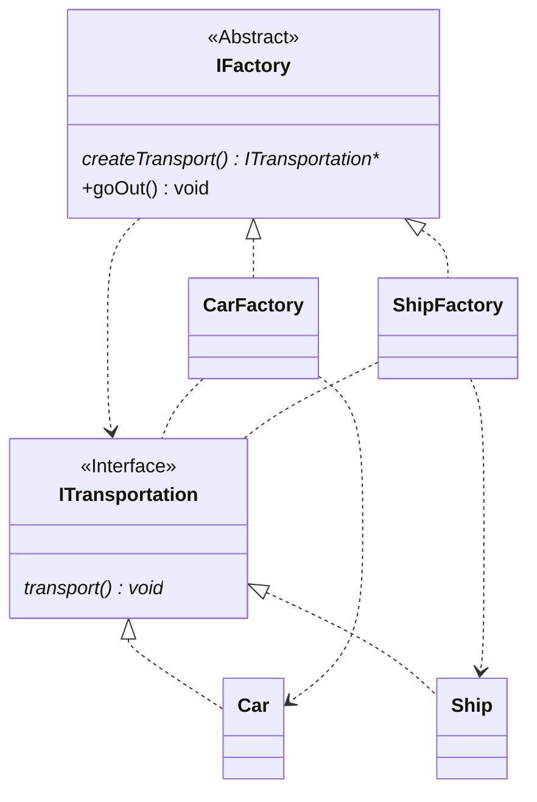

# FactoryMethod

```mermaid
classDiagram
class ITransportation {
  <<Interface>>
  transport() void*
}
ITransportation <|.. Car
ITransportation <|.. Ship

class IFactory {
  <<Abstract>>
  createTransport() ITransportation**
  +goOut() void
}
IFactory ..> ITransportation

IFactory <|.. CarFactory
CarFactory ..> Car
CarFactory .. ITransportation
IFactory <|.. ShipFactory
ShipFactory ..> Ship
ShipFactory .. ITransportation
```
