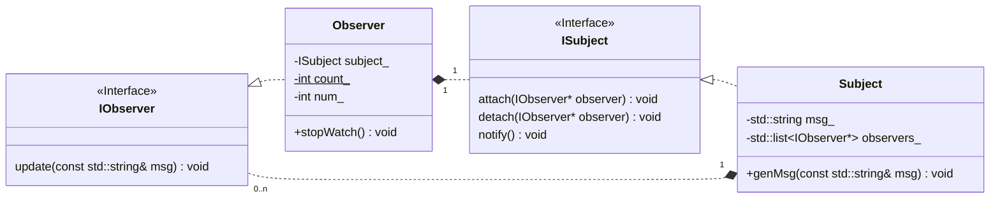

# Observer

```mermaid
classDiagram
direction LR
class IObserver {
  <<Interface>>
  update(const std::string& msg) void
}

class ISubject {
  <<Interface>>
  attach(IObserver* observer) void
  detach(IObserver* observer) void
  notify() void
}

class Subject {
  -std::string msg_
  -std::list~IObserver*~ observers_
  +genMsg(const std::string& msg) void
}

ISubject <|.. Subject
Subject "1" *.. "0..n" IObserver

class Observer {
  -ISubject subject_
  -int count_$
  -int num_
  +stopWatch() void
}

IObserver <|.. Observer
Observer "1" *.. "1" ISubject

```
