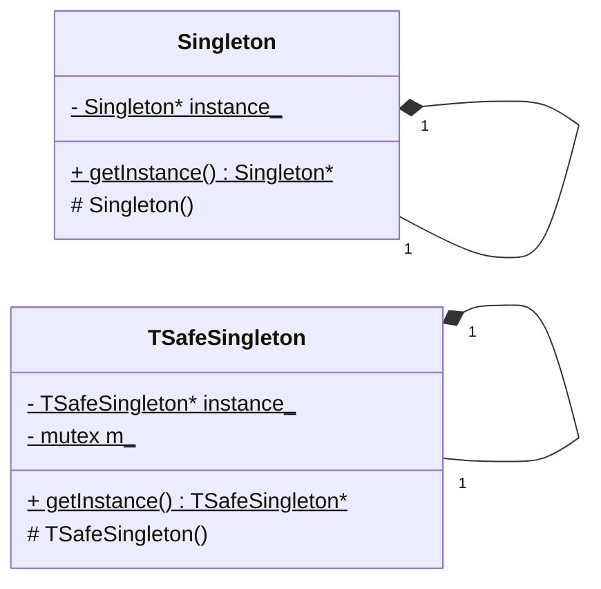

# Singleton

```mermaid
classDiagram
direction LR
class Singleton {
 + getInstance() Singleton*$
 # Singleton()
 - Singleton* instance_$
}
Singleton "1"*--"1" Singleton

class TSafeSingleton {
 + getInstance() TSafeSingleton*$
 # TSafeSingleton()
 - TSafeSingleton* instance_$
 - mutex m_$
}
TSafeSingleton "1"*--"1" TSafeSingleton
```
