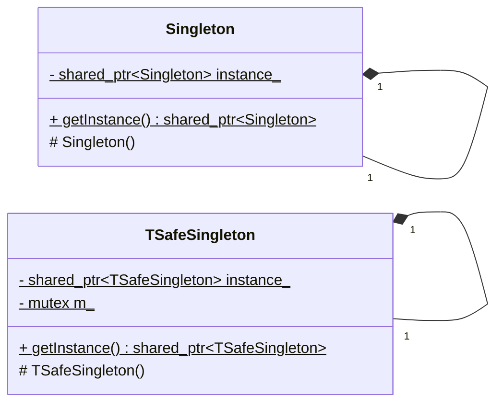

# Singleton

```mermaid
classDiagram
direction LR
class Singleton {
 + getInstance() shared_ptr~Singleton~$
 # Singleton()
 - shared_ptr~Singleton~ instance_$
}
Singleton "1"*--"1" Singleton

class TSafeSingleton {
 + getInstance() shared_ptr~TSafeSingleton~$
 # TSafeSingleton()
 - shared_ptr~TSafeSingleton~ instance_$
 - mutex m_$
}
TSafeSingleton "1"*--"1" TSafeSingleton
```
