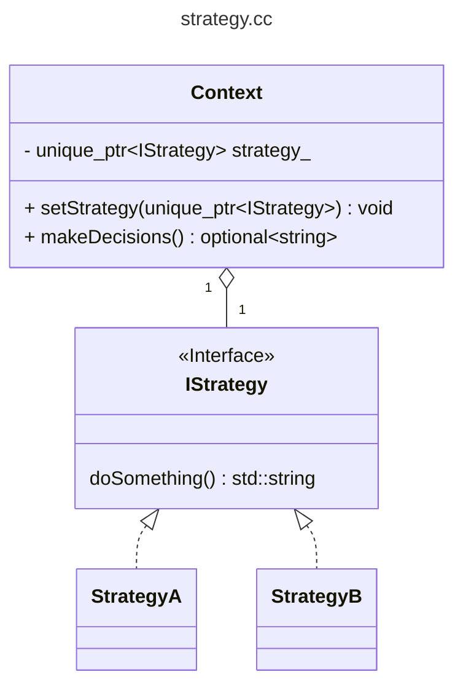
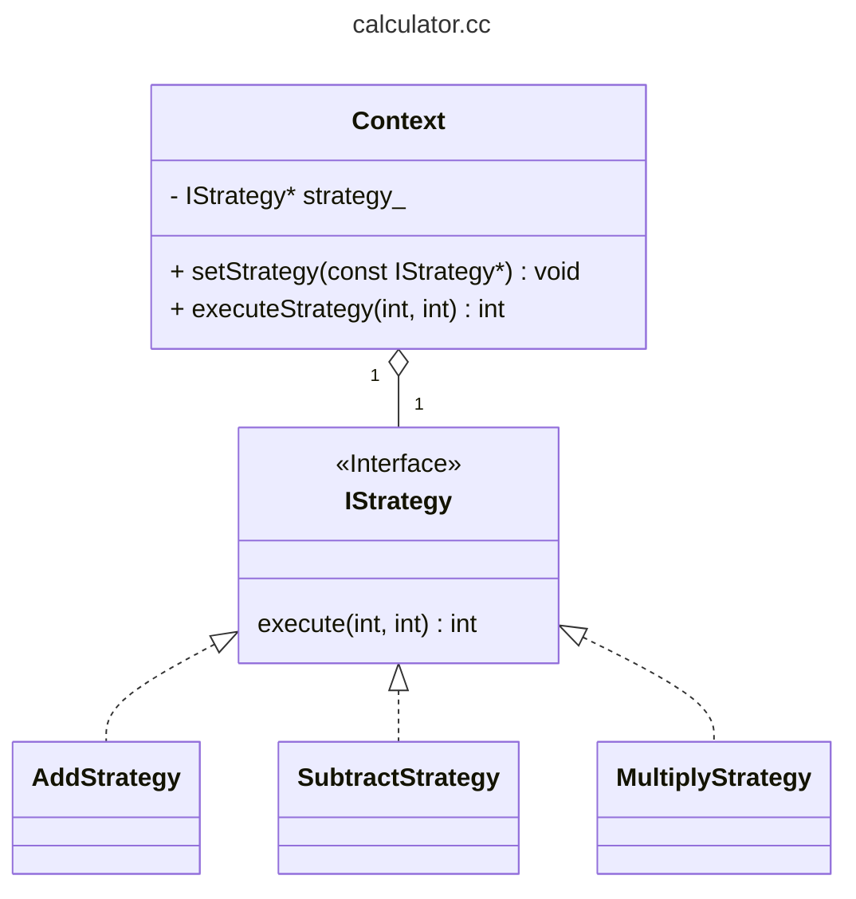

# Strategy

[strategy.cc](./strategy.cc)

```mermaid
---
title: strategy.cc
---
classDiagram
class IStrategy {
  <<Interface>>
  doSomething() std::string
}
IStrategy <|.. StrategyA
IStrategy <|.. StrategyB
class Context {
  - unique_ptr~IStrategy~ strategy_
  + setStrategy(unique_ptr~IStrategy~) void
  + makeDecisions() optional~string~
}
Context "1"o--"1" IStrategy
```

[calculator.cc](./calculator.cc)

```mermaid
---
title: calculator.cc
---
classDiagram
class IStrategy {
  <<Interface>>
  execute(int, int) int
}
IStrategy <|.. AddStrategy
IStrategy <|.. SubtractStrategy
IStrategy <|.. MultiplyStrategy

class Context {
 - IStrategy* strategy_
 + setStrategy(const IStrategy*) void
 + executeStrategy(int, int) int
}

Context "1"o--"1" IStrategy

```
